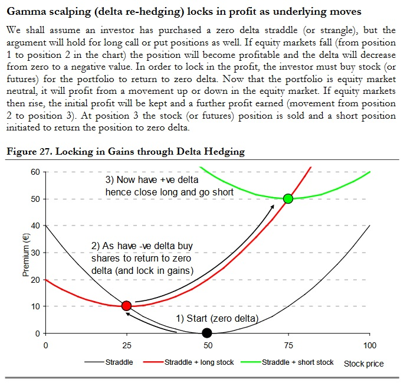

# Gamma Scalping Trading Strategy

## 1. Introduction

This project explores the implementation of a Gamma Scalping Trading Strategy using the SPDR S&P 500 ETF Trust (NYSEARCA: SPY) as a case study. The choice of SPY is due to its high liquidity in both the underlying and options markets. We extracted options data from January 2018 to February 2024, offering a balanced view of recent trading environments and ample data for analysis.

## 2. Methodology Overview

The trading strategy enters long or short gamma positions based on the comparison between implied volatility as indicated by Oliveira et al. and model-free implied volatility from Jiang et al. Decisions to go long or short gamma are made daily, depending on whether the model-free implied volatility is respectively higher or lower than the Black-Scholes implied volatility by a set threshold.

We use a delta-hedged straddle approach to manage our positions, seeking to minimize the number of shares required for initial delta hedging by capitalizing on the offsetting deltas of the put and call options. Our strategy aims for net zero delta, rebalancing daily and exiting each straddle after approximately three weeks to capture most gamma while avoiding the increased volatility leading up to option expiration.

### Code Setup

#### Imports

All dependencies and functions are imported via a source file, ensuring that the notebook remains clean and focused on the strategy logic.

## Results

Our simulation results indicate varied performance across different strategies:

- **Strategy 1 (Model-Free IV Strategy):** Shows a very low correlation with market movement, which is favorable for a market-neutral strategy. However, its Sharpe ratio is low, indicating poor risk-adjusted returns.
  
- **Strategy 2 (Long Gamma Only):** Did not perform well, with profitability being significantly lower compared to other strategies.

- **Strategy 3 (Short Gamma Positioning):** Emerged as the most profitable approach, demonstrating a significant positive annualized return of approximately 11.6%. Despite this, it's important to note that the annualized volatility was higher than the return, which suggests a higher risk level.

Transaction costs appeared less impactful due to the benefits of daily rebalancing, which generally outweighed the costs. Using model-free implied volatility for deciding positions showed a decrease in overall profitability but removed some extreme performances, both positive and negative.

## Conclusions

The analysis supports the hypothesis that long option positions are generally unprofitable on their own due to options pricing IV higher than RV. Short option positions, as expected, performed well under our simulation conditions. The effect of transaction costs was mitigated by daily rebalancing, confirming the efficiency of our strategy in reducing costs.

While using model-free IV reduced overall profitability, it also eliminated outliers, contributing to a more stable, though less profitable, strategy. However, focusing exclusively on short gamma positions, and avoiding positions when the threshold is not met, showed better performance, indicating the potential effectiveness of a selective strategy approach.
